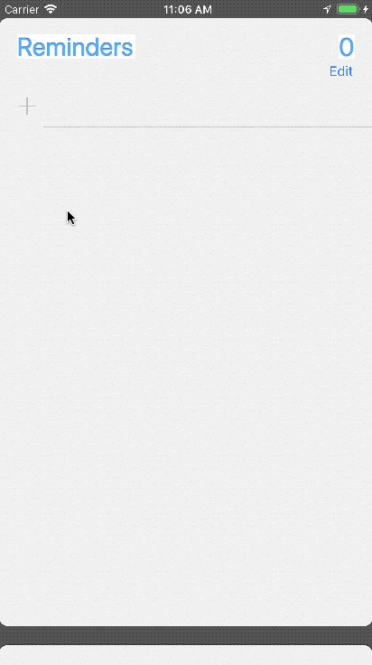
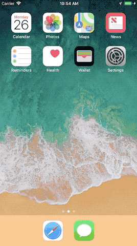

# iOSkeyboard

This keyboard was a school project for the University of Michigan's Software Engineering course. The client had several accessibility requirements, including the ability to easily type with one hand and with as few keystrokes as possible.
This project was my first time writing in Swift, and my first iOS project.

### Typing

### Installation

